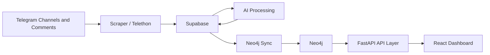

# Radar Obshchiny Professional Documentation

Current-state system and product documentation for the Radar Obshchiny Telegram intelligence platform.

- Last Updated: 2026-03-19
- Deployment Line: GitHub `main`
- Deployment Shape: Railway-compatible frontend + backend split
- Release Focus: dashboard analytics integrity and AI-only service-gap detection

## 1. Product Summary

Radar Obshchiny is a production-oriented intelligence platform for monitoring Telegram communities, enriching messages with AI, syncing structured information into Neo4j, and serving dashboard analytics through a FastAPI + React stack.

The platform is designed for:

- community monitoring
- topic and trend analysis
- behavioral insight generation
- graph-driven audience and conversation analysis
- operational decision support for moderators and community managers

## 2. System Architecture



### Core Runtime Roles

- `scraper/`
  - extracts Telegram posts and comments
  - manages source tracking and collection cadence
- `buffer/`
  - stores and reads operational data in Supabase
  - persists runtime snapshots and helper state
- `processor/`
  - runs message-level AI extraction for intent, sentiment, and topics
- `ingester/`
  - writes normalized graph structures into Neo4j
- `api/`
  - exposes dashboard, graph, and admin endpoints
  - aggregates tiered widget payloads for the frontend
- `frontend/`
  - renders the dashboard and graph experiences

## 3. Data Model and Pipeline Semantics

### Operational Source of Truth

Supabase is the operational system of record for:

- raw scraped content
- AI analysis outputs
- runtime snapshots
- scheduler state
- proposal/review flows
- materialized brief payloads

Neo4j is the analytics graph used for:

- topic analytics
- network analysis
- graph exploration
- dashboard query acceleration

### Message-Level Analytics Rule

The platform now uses strict direct-message semantics:

- one tagged post = one topic mention
- one tagged comment = one topic mention
- comment-derived topics are not copied onto the parent post
- message counts are computed from direct `TAGGED` relationships only

This rule is the basis for current strategic analytics.

### Graph Analytics Retention

Neo4j dashboard analytics are intentionally limited to a clean 15-day window.

Current implications:

- topic trend and landscape metrics operate on the last 15 days
- long-range historical trend behavior is intentionally reduced until clean history accumulates
- strategic widgets favor accuracy of recent data over polluted legacy history

## 4. Dashboard Tier Definitions

The dashboard is assembled in `api/aggregator.py` using tiered query groups. The most important production tiers are:

- Pulse
  - fast community pulse and current momentum
- Strategic
  - topic-level intelligence inside the 15-day graph window
- Behavioral
  - problem and service-gap briefs, satisfaction, mood, urgency
- Network
  - channels, voices, and relationship-oriented views

### Reliability Model

The aggregator uses:

- cache-first reads
- stale-while-revalidate behavior
- bounded parallel execution
- per-tier fallback protection
- preservation of healthy cached snapshots when critical tiers fail

Strategic widgets are isolated so one failed query does not blank the full section.

## 5. Widget Semantics

### Community Climate

Community Climate is an explainable index, not a raw count metric.

It combines:

- constructive intent share
- inverse negative pressure
- topic diversity
- conversation depth

It compares the latest 24 hours against the previous 24 hours.

### Trending Now

Trending Now shows evidence-backed top topics from the last 24 hours.

- counts direct post + comment mentions
- compares current 24h vs previous 24h
- includes message snippets when available

### Topic Landscape

Topic Landscape shows topic prominence inside the 15-day graph window.

- tile size = direct post + comment mentions in the retention window
- growth = recent 7-day slice vs the preceding slice in that retention window
- noisy or invalid topic labels are excluded

### Conversation Trends

Conversation Trends shows daily direct-message counts per topic within the 15-day window.

- buckets are daily
- top lines are chosen from the strongest recent topics
- data reflects direct message tagging only

### Topic Lifecycle

Topic Lifecycle currently functions as a short-window momentum view, not a full lifecycle model.

Current behavior:

- groups topics into `growing` and `declining`
- uses recent vs preceding activity inside the 15-day window
- is best interpreted as momentum classification rather than true lifecycle staging

### Service Gap Detector

Service Gap Detector is now AI-only.

The widget shows service-gap bars only when grounded AI service cards exist.

Current rules:

- service gaps are derived from concrete service/help requests hidden in posts and related comments
- the model must infer a real actionable service need from evidence
- abstract dissatisfaction, slogans, political complaints, and topic names alone are rejected
- there is no production fallback that converts generic topic dissatisfaction into service-gap bars
- if no grounded service cards exist, the widget shows a soft `No service gap detected.` state

### Problem Tracker

Problem Tracker remains AI-grounded with evidence-backed cards built from negative, urgent, and distress-heavy signals.

## 6. AI Systems

### Behavioral Briefs

Behavioral briefs cover:

- problem cards
- service-gap cards
- urgency cards

Current default model:

- `BEHAVIORAL_BRIEFS_MODEL = gpt-5-nano`

Current prompt/version behavior:

- `BEHAVIORAL_BRIEFS_PROMPT_VERSION = behavior-v2`
- fingerprinting includes prompt version and model name
- changed prompts/models invalidate prior cluster fingerprints naturally

### Service-Gap AI Contract

The service-gap AI prompt is intentionally strict.

It must:

- use only supplied evidence
- infer concrete service/help needs from evidence
- reject abstract or non-service discussion
- abstain when grounding is weak
- select evidence IDs that actually support the service card

Deterministic service-card fallback is intentionally disabled for production behavior.

### Other AI Systems

Current defaults:

- `OPENAI_MODEL = gpt-5-nano`
- `QUESTION_BRIEFS_MODEL = gpt-5-nano`
- `QUESTION_BRIEFS_TRIAGE_MODEL = gpt-5-nano`
- `QUESTION_BRIEFS_SYNTHESIS_MODEL = gpt-5-nano`
- `BEHAVIORAL_BRIEFS_MODEL = gpt-5-nano`

## 7. Railway Deployment Compatibility

This release is intended to remain compatible with the current Railway deployment line on GitHub `main`.

### Unchanged Deployment Contract

- no change to frontend Caddy routing
- no new Railway manifest or Procfile requirement
- no service split introduced by this release
- backend remains compatible with the current FastAPI/uvicorn deployment model

### Frontend Proxy Contract

The frontend uses `frontend/Caddyfile` to:

- serve the Vite build output
- reverse proxy `/api/*` to the backend service using `BACKEND_URL`

That contract is unchanged in this release.

### Railway Environment Notes

The following defaults changed in code/config examples:

- `OPENAI_MODEL = gpt-5-nano`
- `QUESTION_BRIEFS_MODEL = gpt-5-nano`
- `QUESTION_BRIEFS_TRIAGE_MODEL = gpt-5-nano`
- `QUESTION_BRIEFS_SYNTHESIS_MODEL = gpt-5-nano`
- `BEHAVIORAL_BRIEFS_MODEL = gpt-5-nano`
- `BEHAVIORAL_BRIEFS_PROMPT_VERSION = behavior-v2`

Compatibility note:

- if Railway does not set these vars explicitly, the new defaults apply automatically
- if Railway already pins any of these values, update the Railway env settings manually to match the release

## 8. Testing and QA

### Required Automated Checks

```bash
python3 -m unittest discover -s tests -p 'test_*.py'
python3 -m compileall api buffer ingester processor scripts tests
npm --prefix frontend run build
```

### Release QA Focus

For the current release, QA should confirm:

- Topic Landscape, Conversation Trends, Trending Now, and Topic Lifecycle all reflect direct-message mention semantics
- strategic widgets remain populated independently when one strategic query fails
- Service Gap Detector never renders fallback-derived bars
- empty service-gap state is soft and non-erroring
- no deployment files or proxy contracts changed for Railway

## 9. Maintenance and Recovery Scripts

The release includes maintenance scripts that support the analytics model:

- `scripts/reset_topic_analytics_window.py`
  - rebuilds the clean analytics window
- `scripts/validate_topic_mentions.py`
  - validates mention counts against direct message totals
- `scripts/remove_redundant_general_topic_links.py`
  - cleans redundant topic taxonomy links that could later create category duplication

These scripts are operational tools and should be used deliberately in production environments.

## 10. Known Product Limits

- Topic Lifecycle is not yet a full lifecycle model.
- The strategic window is intentionally short while clean history rebuilds.
- Service-gap detection can correctly produce no result when grounded service evidence is insufficient.
- Railway parity depends on deployed AI env vars not pinning older model values than the current code defaults.

## 11. Release Notes for the Current Mainline

### Included in This Release

- direct-message mention counting correction
- strategic widget consistency improvements
- 15-day clean graph analytics behavior
- AI-only service-gap detection
- removal of misleading service-gap fallback bars
- documentation rewritten to current-state behavior

### Explicitly Not Included

- Telegram session/export tooling work
- unrelated network/admin/source management changes
- unrelated recovery or QR helper scripts

---

This document is intended to describe the actual shipped system behavior on the current mainline, not an aspirational roadmap. Update it whenever product semantics, deployment behavior, or operational truth changes.
