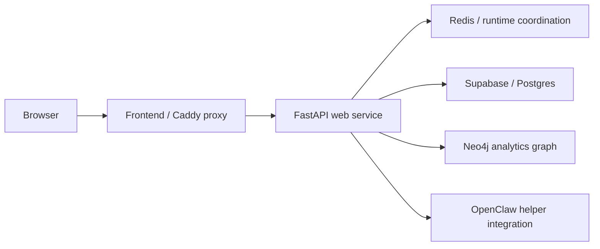
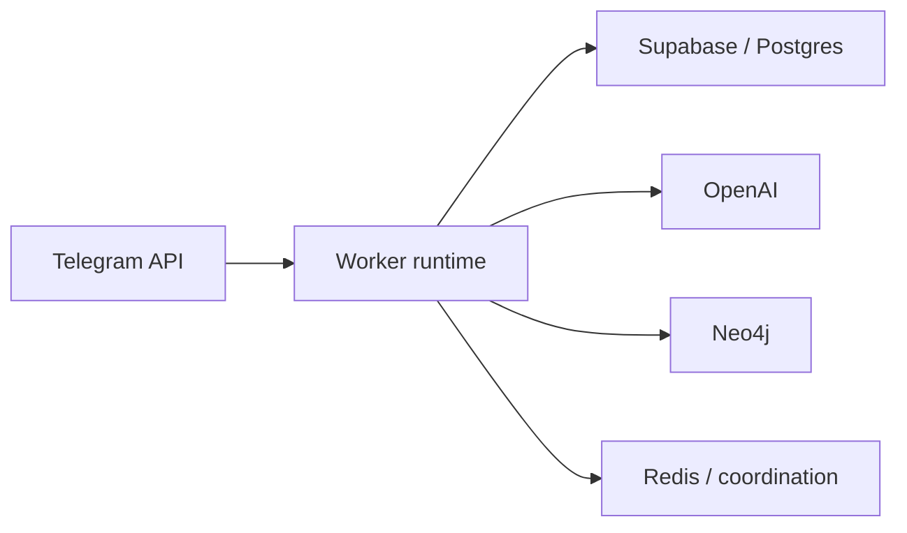

# Radar Obshchiny Canonical System Documentation

Current-state technical documentation for the Radar Obshchiny platform.

- Canonical status: authoritative current-state system document
- Audience: backend engineers, frontend engineers, operators, technical leads
- Last reviewed: 2026-04-19

## 1. Executive Summary

Radar Obshchiny is a Telegram intelligence platform that collects Telegram channel data, enriches it with AI, syncs analytics into a graph model, and serves a protected web application for dashboard analytics, detail pages, operator workflows, and social intelligence surfaces.

Today, the system is deployed as a split runtime:

- `frontend`: React + Vite application served behind a static/proxy layer
- `web`: FastAPI application that serves APIs, orchestrates reads, exposes admin/operator endpoints, and hosts helper integrations
- `worker`: background runtime responsible for Telegram-connected and scheduled background processing
- supporting infrastructure: Supabase/Postgres, Neo4j, Redis, OpenAI, and optional OpenClaw integrations

The system is designed to solve three problems at once:

- collect and normalize Telegram community activity
- transform raw activity into explainable intelligence and briefs
- serve that intelligence through a stable, authenticated product surface without coupling every user request to raw-source processing

This document covers the current shipped platform only. It does not treat experimental branches, incomplete rewrites, legacy design briefs, or abandoned documentation structures as part of the production architecture.

## 2. Architecture Principles and Decisions

### Separation of concerns

The platform deliberately separates:

- operational persistence from analytics modeling
- request-path serving from background processing
- frontend rendering from backend orchestration
- product APIs from operator-only control paths

That separation keeps the request path more stable and makes failures easier to localize.

### Why the platform uses Supabase plus Neo4j

The system uses two primary data backends because they solve different problems well:

- Supabase/Postgres is the operational system of record for scraped content, AI outputs, runtime state, queues, admin configuration, and persisted payloads
- Neo4j is the analytics graph used for relationship-heavy and topic/network-style queries

This is preferable to forcing one database to do both jobs poorly. Operational writes, queue state, and configuration need relational durability. Topic/network analytics benefit from a graph model.

### Why the platform uses worker/background processing

Heavy work is intentionally moved out of the user request path wherever possible:

- Telegram scraping
- AI enrichment
- graph synchronization
- scheduled materializations and brief refreshes

This adds operational complexity, but it improves serving reliability and isolates user-facing APIs from raw ingestion latency and external provider instability.

### Why the platform does not rely on purely live-query serving

A purely live-query architecture would be simpler at first, but it would make the product fragile under load and tightly couple every dashboard request to the slowest dependency in the chain. The current architecture accepts more background machinery in exchange for:

- more predictable response behavior
- clearer failure domains
- better operator control
- safer retries and repair workflows

## 3. System Boundaries and Ownership

### Scraping boundary

Owned by:

- `scraper/`
- worker runtime

Responsibilities:

- connect to Telegram
- discover and prepare sources
- scrape posts and comments
- persist raw content into Supabase-backed storage

This layer owns Telegram connectivity. The web service must not take on Telegram runtime responsibilities in the hardened deployment shape.

### AI enrichment boundary

Owned by:

- `processor/`
- `api/behavioral_briefs.py`
- `api/question_briefs.py`
- `api/opportunity_briefs.py`
- `api/topic_overviews.py`

Responsibilities:

- classify and enrich messages
- generate structured AI outputs
- generate brief-style derived artifacts

This layer transforms content into higher-value intelligence. It does not own frontend presentation contracts.

### Operational persistence boundary

Owned by:

- `buffer/`
- Supabase/Postgres
- runtime/admin configuration helpers

Responsibilities:

- store raw messages and comments
- store AI outputs
- store scheduler/runtime state
- store admin configuration and derived artifacts
- support operator-triggered maintenance and queue workflows

Supabase/Postgres is the authoritative operational store.

### Graph analytics boundary

Owned by:

- `ingester/`
- `api/queries/*`
- Neo4j

Responsibilities:

- synchronize graph-friendly entities and relationships
- serve graph-heavy analytics queries
- support topic, audience, network, and strategic-style read models

Neo4j is authoritative for graph-derived analytics, not for raw operational history.

### API serving boundary

Owned by:

- `api/server.py`
- `api/aggregator.py`
- API-facing service modules under `api/`

Responsibilities:

- authenticate and authorize requests
- compose dashboard and detail responses
- expose health, freshness, admin, KB, and helper endpoints
- separate analytics routes from operator-only routes

This is the primary request-path orchestration layer.

### Frontend rendering boundary

Owned by:

- `frontend/src/app/`

Responsibilities:

- protect routes behind authenticated shells
- render dashboard, detail, admin, graph, social, and helper UI
- normalize backend payloads into stable widget contracts

The frontend owns presentation, interaction, and route composition. It does not own analytics truth.

### Social and operator surfaces

Owned by:

- `social/`
- social endpoints in `api/server.py`
- social pages and services in `frontend/src/app/pages/` and `frontend/src/app/services/`

Responsibilities:

- provide operator-only social intelligence workflows
- expose social evidence, topics, timelines, competitors, ads, and runtime operations

These surfaces are intentionally distinct from the main Telegram dashboard contract.

### Helper integrations

Owned by:

- `api/ai_helper.py`
- KB endpoints in `api/server.py`
- optional OpenClaw gateway/bridge configuration

Responsibilities:

- power the web AI assistant
- support KB ingestion and retrieval flows

These integrations are part of the product, but they are not part of the core dashboard read path.

## 4. Runtime Topology

### Current production-oriented topology

- `frontend`
  - static/proxy deployment for the React application
- `web`
  - FastAPI app served by `uvicorn api.server:app`
- `worker`
  - dedicated background runtime served by `python -m api.worker`
- `redis`
  - runtime coordination and cache support
- `supabase`
  - operational storage
- `neo4j`
  - analytics graph
- external providers
  - Telegram API
  - OpenAI
  - optional OpenClaw gateway or bridge

### Request path

The main request path is:



The request path is responsible for:

- authenticated API access
- dashboard/detail rendering data
- admin/operator read and control endpoints
- helper and KB APIs

It should not be responsible for Telegram scraping or worker-only scheduled processing.

### Background path

The background path is:



The background path is responsible for:

- scraping Telegram sources
- scheduling and running AI enrichment
- graph synchronization
- scheduled brief refreshes
- long-running runtime maintenance work

### Environment split

The hardened deployment contract is:

- `APP_ROLE=web` on the web service
- `APP_ROLE=worker` on the worker service
- Redis configured in locked environments
- staging forced into web-only behavior unless explicitly carved out otherwise

This split matters because it prevents accidental duplication of background writers and keeps Telegram-connected logic out of the request-serving runtime.

## 5. Critical Data Flows

### Telegram ingestion flow

1. Worker-owned scraper connects to Telegram
2. Sources are prepared and scraped
3. Raw posts and comments are persisted into Supabase-backed storage
4. Runtime state and scrape progress are tracked in operational storage

### AI enrichment flow

1. Unprocessed content is discovered from operational storage
2. AI enrichment jobs analyze messages and posts
3. Structured outputs are persisted back to operational storage
4. Derived artifacts and briefs are refreshed on their own schedules

### Graph sync and analytics flow

1. Processed operational data is transformed into graph-friendly bundles
2. Bundles are synchronized into Neo4j
3. Query modules under `api/queries/` read from Neo4j to support dashboard and detail surfaces

### Dashboard request flow

1. Frontend calls `/api/*` through the configured proxy/base URL
2. FastAPI authenticates the caller
3. Dashboard context and freshness state are resolved
4. Aggregation and query modules compose the response
5. Frontend normalizes payloads through `dashboardAdapter` and renders widgets

### Social/operator flow

1. Authenticated operator session calls operator-only social endpoints
2. Backend enforces operator access
3. Social store/runtime services return social-specific summaries, evidence, and operational actions
4. Frontend social pages render those results separately from the main dashboard contract

### Helper and KB flow

1. Authenticated user calls AI helper or KB endpoints
2. Backend mediates access and keeps provider credentials server-side
3. OpenClaw and KB operations run behind backend APIs
4. Frontend receives only product-safe responses, not provider credentials

## 6. Data Model and Source-of-Truth Policy

### Supabase / Postgres

Supabase/Postgres is the operational system of record for:

- scraped Telegram content
- AI enrichment outputs
- scheduler/runtime state
- admin configuration
- persisted artifacts and helper state
- operational queues and recovery state

If a question is about what content was ingested, what was processed, what job ran, or what config is currently active, Supabase/Postgres is the first source of truth.

### Neo4j

Neo4j is the analytics graph. It is authoritative for graph-modeled relationships and the analytics computed from them, including:

- topic relationships
- audience and network relationships
- graph-oriented dashboard queries

It is not the canonical operational ledger for the pipeline.

### Redis

Redis is an operational coordination layer, not a primary data store. It is used for:

- runtime coordination
- health checks that require coordination guarantees
- selected cache/runtime support in locked environments

If Redis is down in locked environments, parts of the hardened runtime contract should be treated as degraded.

### Derived versus canonical data

The platform stores both canonical and derived data:

- canonical
  - raw Telegram content
  - operational state
  - configuration
- derived
  - AI analyses
  - graph projections
  - brief payloads
  - dashboard summaries

Derived data can be rebuilt. Canonical operational history and configuration must be preserved.

### Evidence and source references

The platform is built to serve explainable outputs, not dead aggregates. Widgets and briefs are expected to retain a path back to supporting source evidence. The product should present derived intelligence while keeping a traceable connection to underlying messages, comments, or evidence items when supported by the surface.

## 7. Product Surfaces and Contracts

### Main dashboard

The main dashboard is the primary protected application surface and is rendered at `/`. It depends on:

- `DataContext`
- `DashboardDateRangeContext`
- backend `/api/dashboard`
- `dashboardAdapter` normalization

This is the main analytics entrypoint for the Telegram intelligence product.

### Detail pages

Current first-class detail routes include:

- `/topics`
- `/channels`
- `/audience`
- `/sources`
- `/settings`

These surfaces extend the dashboard into deeper inspection and management flows.

### Graph surface

The graph route exists at `/graph`. It remains part of the product surface, but the frontend service layer treats graph rendering as a specialized boundary. In practice, this means:

- the graph page is part of the app shell
- graph rendering is handled by a dedicated graph dashboard component
- graph-specific behavior should not be documented as identical to the standard dashboard widget pipeline

### Admin surface

The admin route exists at `/admin`. It is used for configuration and management workflows backed by admin configuration state and operator-capable endpoints.

### Social surface

Current social routes include:

- `/social`
- `/social/topics`
- `/social/ops`

These are operator-oriented social intelligence surfaces with their own endpoint family and rendering contracts. They are not a thin alias for the Telegram dashboard.

### Agent and helper surface

The app includes an AI helper/agent surface and backend helper endpoints. This is part of the product experience, but it is not a substitute for the main dashboard APIs.

### Authentication model

At a high level:

- frontend routes are protected by the app auth shell
- Supabase browser auth is preferred when configured
- simple auth fallback exists for environments without browser Supabase auth
- backend analytics endpoints are guarded by analytics access rules
- operator-only endpoints require stronger operator access checks

The exact wire-level auth details live in code and operational docs, but the contract is simple: product routes are authenticated, and operator routes are more restricted than normal analytics reads.

## 8. Operational Invariants

These are system rules that must remain true for safe operation.

### Worker owns background jobs

Worker-owned jobs must not drift into the web runtime in the hardened deployment shape. Telegram-connected and scheduled processing belong to the worker role.

### Web remains request-serving first

The web service exists to serve APIs and product interactions. It may expose operator controls, but it must not become a second uncontrolled worker.

### Staging is constrained on purpose

Staging/testing environments are intentionally constrained to avoid accidental writes and duplicate background behavior. Do not treat staging like an unconstrained clone of production.

### Redis is required in locked environments

Locked environments rely on Redis-backed coordination. Missing Redis in staging or production should be treated as a serious runtime contract violation.

### Auth boundaries must remain explicit

Operator-only routes, analytics routes, KB routes, and helper routes have different access models. Do not flatten these access boundaries for convenience.

### Supabase is the operational ledger

Do not move runtime truth into caches or graphs. Redis and Neo4j support the platform; they do not replace the operational source of truth.

### Cache and rebuild behavior must remain observable

When cache invalidation or runtime refresh behavior changes, the system must continue to expose enough health and freshness information for operators to reason about what is stale, what is warming, and what failed.

### Compatibility paths are not the target architecture

Compatibility-only paths such as historical single-service behavior may still exist in code, but they must not be mistaken for the preferred production topology.

## 9. Developer Onboarding

### Where to start

A new developer should start in this order:

1. this document
2. `README.md`
3. `docs/production_runbook.md`
4. code entrypoints:
   - `api/server.py`
   - `api/worker.py`
   - `config.py`
   - `frontend/src/app/routes.tsx`

### Local development

Backend:

```bash
python3 -m venv venv
source venv/bin/activate
pip install -r requirements.txt
venv/bin/python -m uvicorn api.server:app --reload --port 8001
```

Frontend:

```bash
cd frontend
npm ci
npm run dev
```

### How to test

Backend tests are driven through `pytest`/`unittest` coverage in `tests/`.

Frontend tests and build validation are driven through:

```bash
cd frontend
npm run test
npm run build
```

For release confidence and environment validation, use the smoke and runbook procedures rather than treating local tests as sufficient.

### Repository orientation

Major directories:

- `api/`
  - FastAPI app, aggregation, endpoint orchestration, helper and admin logic
- `scraper/`
  - Telegram scraping and source preparation
- `processor/`
  - AI enrichment logic
- `ingester/`
  - graph synchronization
- `buffer/`
  - operational persistence helpers
- `social/`
  - social intelligence runtime and storage
- `frontend/`
  - React application
- `scripts/`
  - maintenance, validation, and smoke tooling
- `tests/`
  - backend regression coverage

### Additional docs worth reading

- `docs/production_runbook.md`
- `CONTRIBUTING.md`
- targeted testing or handover docs only when working in those specific areas

## 10. Known Compatibility Paths and Historical Notes

- `main.py` remains in the repository as a legacy orchestration path, but it is not the canonical hardened deployment entrypoint
- historical `APP_ROLE=all` behavior still exists for compatibility, but the preferred runtime shape is split `web` plus `worker`
- older architecture and API docs in this repository predate the current documentation cleanup and should be treated as historical or reference material unless they explicitly point back to this document
- previous design briefs, migration notes, and handover docs remain useful as context for their specific topics, but they are not authoritative descriptions of the system as a whole

## Canonical Documentation Rule

If another high-level document conflicts with this file about current architecture, runtime shape, ownership, or source-of-truth policy, this file wins unless a newer explicitly canonical replacement says otherwise.
