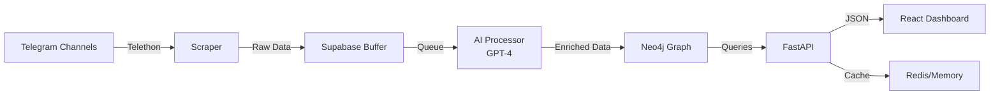

# Radar Obshchiny Monorepo

[](./PROFESSIONAL_DOCUMENTATION.md)
[](./docs/api/)
[](./docs/architecture/)

Production-oriented community intelligence platform with:

- Backend data pipeline + API (Python, FastAPI, Neo4j, Supabase, Telethon)
- Frontend dashboard app (React, Vite, TypeScript)
- AI-powered content analysis (GPT-4, 19 behavioral dimensions)
- Real-time Telegram channel monitoring and intelligence extraction

This repository is now a single monorepo so a new engineer can run and understand the full stack from one place.

## 📚 Documentation

| Documentation | Description | Status |
|--------------|-------------|---------|
| [Professional Documentation Hub](./PROFESSIONAL_DOCUMENTATION.md) | Complete documentation plan and index | ✅ Ready |
| [API Documentation](./docs/api/) | OpenAPI specs, endpoints, examples | 🚧 In Progress |
| [Architecture Guide](./docs/architecture/) | System design, data flow, decisions | 🚧 In Progress |
| [Operations Manual](./docs/operations/) | Deployment, monitoring, runbooks | 📋 Planned |
| [Developer Guide](./docs/development/) | Setup, testing, contributing | 📋 Planned |
| [Security Documentation](./docs/security/) | Security architecture, compliance | 📋 Planned |

## Repository Layout

```text
.
├── api/                    # FastAPI server, dashboard aggregation, query tiers
├── scraper/                # Telegram extraction orchestration
├── processor/              # LLM enrichment (intent/sentiment/topic)
├── ingester/               # Neo4j write path
├── buffer/                 # Supabase/Postgres read-write layer
├── frontend/               # React dashboard application
├── config.py               # central env/config loader + validation
├── main.py                 # pipeline runtime entrypoint
└── requirements.txt        # backend dependencies
```

## Quick Start (Local)

### 1) Prerequisites

- Python 3.10+
- Node.js 20+
- npm 10+
- Access to: Telegram API credentials, Supabase, Neo4j, OpenAI API key

### 2) Configure environment

```bash
cp .env.example .env
cp frontend/.env.example frontend/.env
```

Fill `.env` with real secrets.

### 3) Install dependencies

```bash
python3 -m venv venv
source venv/bin/activate
pip install -r requirements.txt

cd frontend
npm ci
cd ..
```

### 4) Run backend API

```bash
source venv/bin/activate
python -m uvicorn api.server:app --reload --port 8001
```

### 5) Run frontend

```bash
cd frontend
npm run dev
```

Frontend defaults to proxy-style `/api`; set `VITE_API_BASE_URL` in `frontend/.env` if needed.

## Developer Commands

Use `Makefile` shortcuts from repo root:

```bash
make setup-backend
make setup-frontend
make run-api
make run-frontend
make qa
```

## Backend Overview

- `api/server.py`: API endpoints (`/api/dashboard`, `/api/topics`, `/api/channels`, `/api/audience`, graph and scheduler endpoints)
- `api/aggregator.py`: dashboard tier aggregation, cache strategy, stale-safe fallback behavior
- `api/queries/*.py`: Cypher query contracts grouped by semantic tier
- `api/scraper_scheduler.py`: periodic + manual run control

### Data Pipeline Flow

1. Scrape Telegram public channels/comments
2. Persist raw data in Supabase
3. Enrich text with LLM analysis (intent/sentiment/topics)
4. Sync into Neo4j graph
5. API query layer assembles dashboard payloads for frontend

## Frontend Overview

- `frontend/src/app/contexts/DataContext.tsx`: dashboard data bootstrap
- `frontend/src/app/services/dashboardAdapter.ts`: backend -> UI adapter
- `frontend/src/app/services/detailData.ts`: dedicated Topics/Channels/Audience loading
- `frontend/src/app/pages/*`: dashboard + detail pages
- `frontend/src/app/graph/*`: graph experience

## Quality Gates

- Backend syntax check:

```bash
python3 -m compileall api buffer scraper processor ingester
```

- Frontend production build:

```bash
cd frontend && npm run build
```

- CI runs both checks on pushes/PRs (`.github/workflows/ci.yml`).

## Environment Variables

See `.env.example` for required variables.

Most important:

- `TELEGRAM_API_ID`, `TELEGRAM_API_HASH`, `TELEGRAM_PHONE`
- `SUPABASE_URL`, `SUPABASE_SERVICE_ROLE_KEY`
- `NEO4J_URI`, `NEO4J_USERNAME`, `NEO4J_PASSWORD`, `NEO4J_DATABASE`
- `OpenAI_API`

## Security Notes

- Never commit `.env`, `.session`, or service keys
- Use least-privilege credentials for production
- Restrict CORS and scheduler control endpoints in production deployments

## Troubleshooting

- If dashboard is blank, hit `POST /api/cache/clear` and reload
- If detail pages are slow/empty, verify Neo4j connectivity via `GET /api/health`
- If frontend cannot reach API, set `VITE_API_BASE_URL=http://127.0.0.1:8001/api`

## 🏗️ Architecture Overview



### Key Features

- **Real-time Monitoring**: Continuous Telegram channel scanning
- **AI Analysis**: 19-dimension behavioral analysis per comment
- **Graph Intelligence**: Neo4j-powered relationship mapping
- **Smart Caching**: Stale-while-revalidate with tier-based queries
- **Enterprise Ready**: Production monitoring, error handling, scaling

## 📊 System Metrics

| Metric | Value | Description |
|--------|-------|-------------|
| Channels Monitored | 20+ | Active Telegram channels |
| Messages Processed | 10K+/day | Daily message throughput |
| AI Dimensions | 19 | Behavioral analysis points |
| API Response Time | <500ms | P95 latency |
| Cache Hit Rate | 85% | Dashboard caching efficiency |

## 🚀 Deployment

The platform is designed for cloud deployment:

- **Recommended**: [Railway.com](https://railway.app) (see [deployment guide](./docs/operations/deployment/railway.md))
- **Alternative**: Docker Compose, Kubernetes
- **Databases**: Neo4j Aura, Supabase Cloud
- **Monitoring**: Built-in health checks and metrics

## 🔒 Security

- TLS encryption for all communications
- JWT-based API authentication
- Rate limiting and DDoS protection
- Input validation and sanitization
- Regular security audits

See [Security Documentation](./docs/security/) for details.

## 🧪 Testing

```bash
# Backend tests
pytest --cov=api

# Frontend tests
npm run test

# E2E tests
npm run test:e2e
```

See [Testing Guide](./docs/development/testing/) for comprehensive testing documentation.

## Contributing

Start with `CONTRIBUTING.md` for branch, QA, and commit standards.

## 📈 Project Status

- **Version**: 2.0.0
- **Status**: Production Ready
- **Documentation**: Professional (see [PROFESSIONAL_DOCUMENTATION.md](./PROFESSIONAL_DOCUMENTATION.md))
- **Test Coverage**: Target 80% (currently implementing)
- **License**: See LICENSE file
