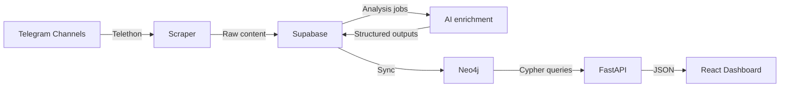

# Radar Obshchiny Monorepo

[](./PROFESSIONAL_DOCUMENTATION.md)
[](./docs/api/)
[](./docs/architecture/)

Production-oriented intelligence platform for Telegram community monitoring, social-media evidence review, AI enrichment, graph analytics, and dashboard delivery.

## What This Repository Ships

- FastAPI backend for dashboard and graph APIs
- Telegram scraping/orchestration with Telethon
- Supabase-backed operational storage and runtime state
- Neo4j analytics graph for strategic and network queries
- React + Vite dashboard frontend
- AI-powered enrichment and brief generation
- Operator-only social dashboard and social topics surfaces

## Current Dashboard Semantics

- A topic mention means one directly tagged message: one post or one comment.
- Strategic graph analytics use a clean 15-day Neo4j retention window by default.
- Topic Landscape and Conversation Trends operate on direct message mentions only.
- Topic Lifecycle is currently a short-window momentum classifier inside the 15-day window, not a full multi-stage lifecycle model.
- Service Gap Detector is AI-only. It shows AI-grounded service-gap bars when valid service cards exist, and a soft `No service gap detected.` state when they do not.

## Current Social Surface Semantics

- `/social` is a dashboard twin of the main Telegram dashboard, but it stays on separate social endpoints and social frontend contracts.
- `/social/topics` mirrors the Telegram Topics UX while using only social topics, social trend series, and social evidence.
- Social routes remain operator-only and are backed by `/api/social/*` endpoints with `require_operator_access`.
- Social topic detail is intentionally evidence-only in v1. It does not reuse Telegram AI topic-overview cards.
- Unmapped Telegram widgets remain visible on `/social` as explicit social placeholders rather than synthetic or backfilled data.

## Repository Layout

```text
.
├── api/                    # FastAPI server, aggregation, query tiers, AI briefs
├── scraper/                # Telegram extraction orchestration
├── processor/              # LLM extraction / enrichment
├── ingester/               # Neo4j write path
├── buffer/                 # Supabase/Postgres read-write layer
├── frontend/               # React dashboard application
├── scripts/                # Maintenance, validation, and rebuild utilities
├── tests/                  # Python regression coverage
├── config.py               # Central env/config loader
└── requirements.txt        # Backend dependencies
```

## Architecture Overview



## Local Quick Start

### 1. Prerequisites

- Python 3.10+
- Node.js 20+
- npm 10+
- Telegram API credentials
- Supabase project
- Neo4j database
- OpenAI API key

### 2. Configure environment

```bash
cp .env.example .env
cp frontend/.env.example frontend/.env
```

Fill `.env` with real secrets before running the stack.

### 3. Install dependencies

```bash
python3 -m venv venv
source venv/bin/activate
pip install -r requirements.txt

cd frontend
npm ci
cd ..
```

### 4. Run backend

```bash
venv/bin/python -m uvicorn api.server:app --reload --port 8001
```

### 5. Run frontend

```bash
cd frontend
npm run dev
```

The frontend defaults to `http://127.0.0.1:5174/` and proxies `/api` to `http://127.0.0.1:8001`. Set `VITE_API_BASE_URL` in `frontend/.env` if you want an explicit backend URL.

## Important Environment Variables

Backend:

- `TELEGRAM_API_ID`, `TELEGRAM_API_HASH`, `TELEGRAM_PHONE`
- `SUPABASE_URL`, `SUPABASE_SERVICE_ROLE_KEY`
- `NEO4J_URI`, `NEO4J_USERNAME`, `NEO4J_PASSWORD`, `NEO4J_DATABASE`
- `OPENAI_API_KEY`
- `APP_ROLE` optional, default `all` for the current single-service deployment; use `web` only when a separate worker service is running background jobs, and `worker` on that dedicated worker
- `ANALYTICS_API_REQUIRE_AUTH` default `false`
- `ANALYTICS_API_KEY_FRONTEND` for the frontend proxy
- `ANALYTICS_API_KEY_OPENCLAW` for OpenClaw/server-to-server calls
- `ANALYTICS_RATE_LIMIT_ENABLED` default `true`
- `ANALYTICS_RATE_LIMIT_WINDOW_SECONDS` default `60`
- `ANALYTICS_RATE_LIMIT_MAX_REQUESTS` default `120`
- `OPENCLAW_GATEWAY_BASE_URL` backend-only OpenClaw Gateway base URL for the web AI helper and KB generation
- `OPENCLAW_GATEWAY_TOKEN` backend-only OpenClaw Gateway token for the web AI helper and KB generation
- `OPENCLAW_ANALYTICS_AGENT_ID` OpenClaw agent id that must match the Telegram analytics bot agent
- `OPENCLAW_WEB_SESSION_KEY` dedicated persistent OpenClaw session key for the web helper, for example `tg-analyst-ru-web-admin`
- `OPENCLAW_KB_SESSION_KEY` dedicated persistent OpenClaw session key for KB generation, for example `tg-analyst-ru-web-kb`
- `OPENCLAW_HELPER_TIMEOUT_SECONDS` default `30`
- `AI_HELPER_ADMIN_SUPABASE_USER_ID` required in production; only this Supabase user can use the web AI helper
- `AI_HELPER_ADMIN_EMAIL` optional local/dev-only fallback if you need to test admin access before user-id wiring
- `OPENAI_MODEL` default `gpt-5.4-mini`
- `QUESTION_BRIEFS_MODEL` default `gpt-5.4-mini`
- `QUESTION_BRIEFS_TRIAGE_MODEL` default `gpt-5.4-mini`
- `QUESTION_BRIEFS_SYNTHESIS_MODEL` default `gpt-5.4-mini`
- `GRAPH_ANALYTICS_RETENTION_DAYS` default `15`
- `BEHAVIORAL_BRIEFS_MODEL` default `gpt-5.4-mini`
- `BEHAVIORAL_BRIEFS_PROMPT_VERSION` default `behavior-v2`

Frontend:

- `VITE_API_BASE_URL` default `/api`
- `BACKEND_ANALYTICS_API_KEY_FRONTEND` runtime secret for Caddy proxy injection
- `VITE_SUPABASE_URL` browser Supabase Auth URL used to read the current admin session
- `VITE_SUPABASE_ANON_KEY` browser Supabase Auth anon key used to read the current admin session

## AI Systems

- The main extraction pipeline defaults to `gpt-5.4-mini` through `OPENAI_MODEL`.
- Question briefs default to `gpt-5.4-mini` for primary, triage, and synthesis passes.
- Behavioral briefs default to `gpt-5.4-mini`.
- Service-gap cards are generated only from grounded service/help evidence in posts and related comments. There is no production fallback that turns generic topic dissatisfaction into service-gap bars.

## Recommended Deployment Shape

The recommended Railway topology for the hardened release is:

- `frontend`: existing static/Caddy deployment
- `web`: `uvicorn api.server:app --host 0.0.0.0 --port $PORT`
- `worker`: `python -m api.worker`
- `redis`: managed Redis

Testing release-candidate topology in the same Railway project:

- `frontend-testing`: same frontend build, separate testing URL
- `web-testing`: same backend code, same real credentials, but **web-only**
- do **not** create `worker-testing` while testing still shares the real data plane
- use the same live Telegram/social databases, graphs, Redis, and provider keys
- route `staging` branch deployments to the testing URL and keep `main` production-only

Critical safety rule for the testing URL:

- testing shares the live databases with production
- therefore testing must not run background writers automatically
- enforce `APP_ROLE=web` and `RUN_STARTUP_WARMERS=false`
- manual social validation is allowed only through operator endpoints such as `/api/social/runtime/run-once`
- only one active social writer should run at a time during controlled validation windows

Compatibility note:

- the repo still preserves the historical `APP_ROLE=all` mode for legacy single-service deployments
- that mode is compatibility-only and should not be treated as the target production shape for the 8.5/10 plan
- for production hardening, use `APP_ROLE=web` on the web service and `APP_ROLE=worker` on the worker service
- the canonical Stage 1 web/worker env split now lives in [production_runbook.md](/Users/harutnahapetyan/Documents/Gemini/Telegram/docs/production_runbook.md)

Operational note:

- if Railway does not explicitly set the AI model variables, the new defaults apply automatically
- if Railway already pins any of these values, update them manually for parity with this release:
  `OPENAI_MODEL`, `QUESTION_BRIEFS_MODEL`, `QUESTION_BRIEFS_TRIAGE_MODEL`, `QUESTION_BRIEFS_SYNTHESIS_MODEL`, `BEHAVIORAL_BRIEFS_MODEL`, `BEHAVIORAL_BRIEFS_PROMPT_VERSION`

The frontend still expects `/api/*` to be reverse-proxied to the backend through `BACKEND_URL` in Railway.

Testing URL setup:

- set `BACKEND_URL` on `frontend-testing` to the Railway URL of `web-testing`
- keep the same `BACKEND_ANALYTICS_API_KEY_FRONTEND` injection model
- use the same real secrets as production unless and until you intentionally build isolated staging data services later

Analytics auth rollout:

- deploy backend code with auth support while `ANALYTICS_API_REQUIRE_AUTH=false`
- set backend + frontend + OpenClaw env vars
- deploy frontend proxy change
- verify website and OpenClaw both still work
- flip `ANALYTICS_API_REQUIRE_AUTH=true`
- run smoke tests again

Immediate rollback:

- if there is an outage, set `ANALYTICS_API_REQUIRE_AUTH=false` and redeploy

## OpenClaw Web AI Helper

- The dashboard floating AI helper now talks to OpenClaw through the backend only. The browser never receives OpenClaw credentials.
- The app does not need OpenClaw Control UI for this integration. Control UI origin and device-auth settings are only relevant if humans open OpenClaw's own web UI.
- Telegram and web must share the same `OPENCLAW_ANALYTICS_AGENT_ID`, but they must not share the same session key.
- Telegram keeps its existing OpenClaw session/memory untouched.
- The web helper uses only `OPENCLAW_WEB_SESSION_KEY`, so refreshes keep the same web conversation and resets affect only that web session.
- KB generation may also use OpenClaw through the backend, but it must use `OPENCLAW_KB_SESSION_KEY` so grounded KB prompts never mix with the floating helper conversation.

Production integration notes:

- Keep OpenClaw Gateway on shared-secret token auth for the app backend calls.
- Expose OpenClaw on a dedicated HTTPS API hostname if needed, but treat it as a backend dependency rather than a browser app.
- Do not reuse `ANALYTICS_API_KEY_OPENCLAW` for `/api/ai-helper/*`; that token is only for OpenClaw skills calling the app's read-only/server-to-server APIs.

Resetting the web helper:

- use the Clear button in the floating helper UI, which calls `POST /api/ai-helper/reset`
- or call `POST /api/ai-helper/reset` directly from an authenticated admin session

Verification checklist:

- web helper answers analytics questions using the same intelligence as Telegram
- Telegram bot still works unchanged
- web helper history survives page refresh
- resetting the web helper does not affect Telegram context
- failures return clean UI-safe messages and no OpenClaw secret reaches the browser

## Validation Commands

Backend QA:

```bash
make qa-backend
```

Frontend QA:

```bash
make qa-frontend
```

Smoke checks against a deployed environment:

```bash
DEPLOY_BASE_URL=https://your-app.example.com \
ANALYTICS_API_KEY_FRONTEND=... \
ADMIN_API_KEY=... \
make smoke-check
```

GitHub required check recommendation:

- protect `main` with the `quality-gate` status check from [ci.yml](/Users/harutnahapetyan/Documents/Gemini/Telegram/.github/workflows/ci.yml)
- keep [post-deploy-warmup.yml](/Users/harutnahapetyan/Documents/Gemini/Telegram/.github/workflows/post-deploy-warmup.yml) as a post-release validation step, not the only release gate

## Operational Scripts

Relevant maintenance scripts for the current analytics stack:

- `scripts/reset_topic_analytics_window.py` — resets and rebuilds the clean analytics window
- `scripts/validate_topic_mentions.py` — validates direct-message mention counts
- `scripts/remove_redundant_general_topic_links.py` — removes redundant `General` taxonomy links when a stronger category exists

## Documentation

- [`PROFESSIONAL_DOCUMENTATION.md`](./PROFESSIONAL_DOCUMENTATION.md) — current-state system and product documentation
- [`docs/api/`](./docs/api/) — API references
- [`docs/architecture/`](./docs/architecture/) — architecture references
- [`frontend/README.md`](./frontend/README.md) — frontend runtime notes

## Security Notes

- Never commit `.env`, Telegram sessions, or service credentials
- Use least-privilege credentials in production
- Restrict admin and scheduler endpoints in deployed environments

## Status

- Deployment target: Railway-compatible mainline
- Graph analytics window: 15 days
- Service-gap mode: AI-only
- Documentation status: current-state and release-aligned
