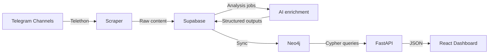

# Radar Obshchiny Monorepo

[](./PROFESSIONAL_DOCUMENTATION.md)
[](./docs/api/)
[](./docs/architecture/)

Production-oriented Telegram intelligence platform for community monitoring, AI enrichment, graph analytics, and dashboard delivery.

## What This Repository Ships

- FastAPI backend for dashboard and graph APIs
- Telegram scraping/orchestration with Telethon
- Supabase-backed operational storage and runtime state
- Neo4j analytics graph for strategic and network queries
- React + Vite dashboard frontend
- AI-powered enrichment and brief generation

## Current Dashboard Semantics

- A topic mention means one directly tagged message: one post or one comment.
- Strategic graph analytics use a clean 15-day Neo4j retention window by default.
- Topic Landscape and Conversation Trends operate on direct message mentions only.
- Topic Lifecycle is currently a short-window momentum classifier inside the 15-day window, not a full multi-stage lifecycle model.
- Service Gap Detector is AI-only. It shows AI-grounded service-gap bars when valid service cards exist, and a soft `No service gap detected.` state when they do not.

## Repository Layout

```text
.
├── api/                    # FastAPI server, aggregation, query tiers, AI briefs
├── scraper/                # Telegram extraction orchestration
├── processor/              # LLM extraction / enrichment
├── ingester/               # Neo4j write path
├── buffer/                 # Supabase/Postgres read-write layer
├── frontend/               # React dashboard application
├── scripts/                # Maintenance, validation, and rebuild utilities
├── tests/                  # Python regression coverage
├── config.py               # Central env/config loader
└── requirements.txt        # Backend dependencies
```

## Architecture Overview



## Local Quick Start

### 1. Prerequisites

- Python 3.10+
- Node.js 20+
- npm 10+
- Telegram API credentials
- Supabase project
- Neo4j database
- OpenAI API key

### 2. Configure environment

```bash
cp .env.example .env
cp frontend/.env.example frontend/.env
```

Fill `.env` with real secrets before running the stack.

### 3. Install dependencies

```bash
python3 -m venv venv
source venv/bin/activate
pip install -r requirements.txt

cd frontend
npm ci
cd ..
```

### 4. Run backend

```bash
source venv/bin/activate
python -m uvicorn api.server:app --reload --port 8001
```

### 5. Run frontend

```bash
cd frontend
npm run dev
```

The frontend defaults to `/api`. Set `VITE_API_BASE_URL` in `frontend/.env` if you want an explicit backend URL.

## Important Environment Variables

Backend:

- `TELEGRAM_API_ID`, `TELEGRAM_API_HASH`, `TELEGRAM_PHONE`
- `SUPABASE_URL`, `SUPABASE_SERVICE_ROLE_KEY`
- `NEO4J_URI`, `NEO4J_USERNAME`, `NEO4J_PASSWORD`, `NEO4J_DATABASE`
- `OPENAI_API_KEY`
- `OPENAI_MODEL` default `gpt-5-nano`
- `QUESTION_BRIEFS_MODEL` default `gpt-5-nano`
- `QUESTION_BRIEFS_TRIAGE_MODEL` default `gpt-5-nano`
- `QUESTION_BRIEFS_SYNTHESIS_MODEL` default `gpt-5-nano`
- `GRAPH_ANALYTICS_RETENTION_DAYS` default `15`
- `BEHAVIORAL_BRIEFS_MODEL` default `gpt-5-nano`
- `BEHAVIORAL_BRIEFS_PROMPT_VERSION` default `behavior-v2`

Frontend:

- `VITE_API_BASE_URL` default `/api`

## AI Systems

- The main extraction pipeline defaults to `gpt-5-nano` through `OPENAI_MODEL`.
- Question briefs default to `gpt-5-nano` for primary, triage, and synthesis passes.
- Behavioral briefs default to `gpt-5-nano`.
- Service-gap cards are generated only from grounded service/help evidence in posts and related comments. There is no production fallback that turns generic topic dissatisfaction into service-gap bars.

## Railway Compatibility

The current release remains compatible with the GitHub `main` / Railway deployment shape:

- no change to the frontend Caddy reverse proxy contract
- no new Railway manifest or service split
- no new dependency requirements beyond the existing backend/frontend stacks

Operational note:

- if Railway does not explicitly set the AI model variables, the new defaults apply automatically
- if Railway already pins any of these values, update them manually for parity with this release:
  `OPENAI_MODEL`, `QUESTION_BRIEFS_MODEL`, `QUESTION_BRIEFS_TRIAGE_MODEL`, `QUESTION_BRIEFS_SYNTHESIS_MODEL`, `BEHAVIORAL_BRIEFS_MODEL`, `BEHAVIORAL_BRIEFS_PROMPT_VERSION`

The frontend still expects `/api/*` to be reverse-proxied to the backend through `BACKEND_URL` in Railway.

## Validation Commands

Backend syntax / import checks:

```bash
python3 -m compileall api buffer ingester processor scripts tests
```

Backend tests:

```bash
python3 -m unittest discover -s tests -p 'test_*.py'
```

Frontend production build:

```bash
npm --prefix frontend run build
```

## Operational Scripts

Relevant maintenance scripts for the current analytics stack:

- `scripts/reset_topic_analytics_window.py` — resets and rebuilds the clean analytics window
- `scripts/validate_topic_mentions.py` — validates direct-message mention counts
- `scripts/remove_redundant_general_topic_links.py` — removes redundant `General` taxonomy links when a stronger category exists

## Documentation

- [`PROFESSIONAL_DOCUMENTATION.md`](./PROFESSIONAL_DOCUMENTATION.md) — current-state system and product documentation
- [`docs/api/`](./docs/api/) — API references
- [`docs/architecture/`](./docs/architecture/) — architecture references
- [`frontend/README.md`](./frontend/README.md) — frontend runtime notes

## Security Notes

- Never commit `.env`, Telegram sessions, or service credentials
- Use least-privilege credentials in production
- Restrict admin and scheduler endpoints in deployed environments

## Status

- Deployment target: Railway-compatible mainline
- Graph analytics window: 15 days
- Service-gap mode: AI-only
- Documentation status: current-state and release-aligned
